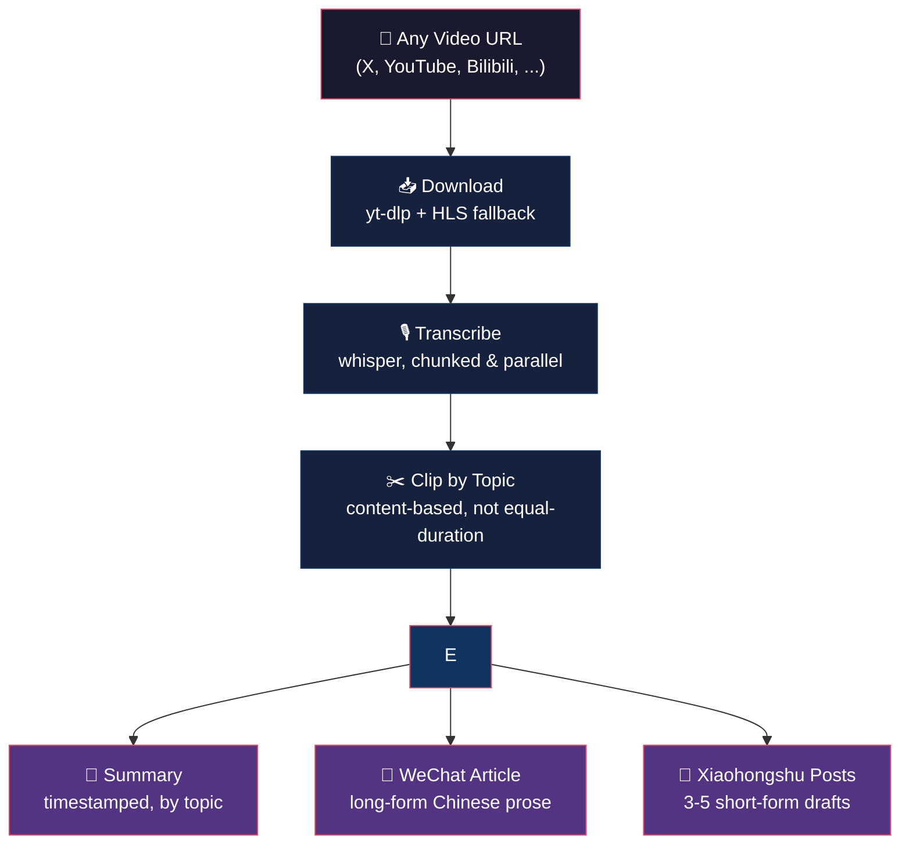

# Video Content Pipeline

Turn long-form videos into topic-based clips, timestamped summaries, and Chinese-language content assets — ready for WeChat (公众号), Xiaohongshu (小红书), and personal learning.

长视频 → 按主题裁剪 + 时间戳总结 + 公众号文章 + 小红书帖子，一条龙。

---

## What It Does



## Output Structure

```
video_x_123456/
├── source.mp4              # Full video
├── full_transcript.txt     # Timestamped transcript
├── clips/
│   ├── 01_opening_thesis.mp4
│   ├── 02_case_study.mp4
│   └── ...
├── clip_plan.csv           # Clip index with timestamps and topics
├── content_summary.md      # Timestamped summary (Chinese)
├── wechat_article.md       # WeChat long-form article
└── xiaohongshu_posts.md    # 3-5 short-form post drafts
```

## Quick Start

Choose your path:

### Path A: Codex Users (one command)

```bash
$skill-installer install github.com/MrHu1226/video-content-pipeline
```

Done. Start chatting:

```
帮我处理这个视频 https://x.com/user/status/123456
```

### Path B: Claude Code Users

```bash
# 1. Clone the skill
git clone https://github.com/MrHu1226/video-content-pipeline.git \
  ~/.agents/skills/video-content-pipeline

# 2. Install Python dependencies
pip install -r ~/.agents/skills/video-content-pipeline/requirements.txt

# 3. Install ffmpeg (if not already installed)
brew install ffmpeg          # macOS
sudo apt install ffmpeg      # Ubuntu/Debian
```

Then in Claude Code, chat naturally:

```
下载这个视频并按主题剪辑 https://x.com/user/status/123456
```

Or reference the skill explicitly:

```
@~/.agents/skills/video-content-pipeline/SKILL.md
帮我处理这个视频 https://youtube.com/watch?v=xxx
```

### Path C: Standalone Scripts (no AI needed)

```bash
# 1. Clone and install
git clone https://github.com/MrHu1226/video-content-pipeline.git
cd video-content-pipeline
pip install -r requirements.txt
brew install ffmpeg          # macOS (if not installed)

# 2. Download video
python scripts/download_video.py "https://x.com/user/status/123456" ./output

# 3. Transcribe
python scripts/chunk_and_transcribe.py ./output/source.mp4 ./output

# 4. Edit clip_plan.csv based on full_transcript.txt, then cut clips
python scripts/bulk_encode_clips.py ./output/source.mp4 ./output/clip_plan.csv ./output/clips
```

Run any script with `--help` for full options:

```bash
python scripts/download_video.py --help
python scripts/chunk_and_transcribe.py --help       # --model, --chunk-minutes
python scripts/bulk_encode_clips.py --help           # --crf, --preset
```

## Requirements

- Python 3.10+
- [ffmpeg](https://ffmpeg.org/download.html) (system install)
- Python dependencies (auto-installed via `pip install -r requirements.txt`):
  - [yt-dlp](https://github.com/yt-dlp/yt-dlp) — video downloading
  - [openai-whisper](https://github.com/openai/whisper) — local transcription

## What You Can Ask the AI to Do

```bash
# Download only
下载这个视频 https://x.com/user/status/123456

# Download + clip
帮我把这个视频按主题剪成片段 https://youtube.com/watch?v=xxx

# Download + clip + summary
处理这个视频，剪辑并写总结 https://x.com/user/status/123456

# Full pipeline: download + clip + WeChat article + Xiaohongshu posts
全流程处理这个视频 https://youtube.com/watch?v=xxx

# Content only (if you already have the video)
根据这个视频的转录文本写一篇公众号文章

# English works too
Summarize this video and write a WeChat article https://youtube.com/watch?v=xxx
```

## Example Output

See the [`examples/`](examples/) directory for sample outputs:

- [`clip_plan.csv`](examples/clip_plan.csv) — clip index with 10 topic-based segments
- [`content_summary.md`](examples/content_summary.md) — full timestamped summary in Chinese
- [`xiaohongshu_posts.md`](examples/xiaohongshu_posts.md) — 5 ready-to-post Xiaohongshu drafts

## Supported Platforms

| Platform | Download | Auto-captions | Notes |
|----------|----------|---------------|-------|
| X/Twitter | yt-dlp + HLS fallback | No | Frequently needs fallback |
| YouTube | yt-dlp | Yes | Prefer auto-captions over whisper |
| Bilibili | yt-dlp | Varies | DASH streams, auto-merged |
| Others | yt-dlp | Varies | Any [yt-dlp supported site](https://github.com/yt-dlp/yt-dlp/blob/master/supportedsites.md) |

See [`references/platform_workarounds.md`](references/platform_workarounds.md) for platform-specific troubleshooting.

## Project Structure

```
video-content-pipeline/
├── SKILL.md                    # AI agent instructions (core workflow)
├── agents/openai.yaml          # Codex UI metadata
├── scripts/                    # Standalone Python tools
│   ├── download_video.py       #   download + HLS auto-fallback
│   ├── chunk_and_transcribe.py #   chunked parallel transcription
│   └── bulk_encode_clips.py    #   batch clip encoding
├── references/                 # Detailed docs (loaded by AI on demand)
│   ├── platform_workarounds.md #   per-platform download fixes
│   ├── content_templates.md    #   WeChat / Xiaohongshu writing templates
│   └── ffmpeg_patterns.md      #   ffmpeg command cheat sheet
├── assets/
│   └── clip_plan_template.csv  #   clip_plan.csv format template
└── examples/                   # Sample outputs
    ├── clip_plan.csv
    ├── content_summary.md
    └── xiaohongshu_posts.md
```

## License

[MIT](LICENSE)

---

## 中文说明

### 这是什么

一个 AI agent skill + 独立工具集，把长视频自动处理成：

1. **按主题裁剪的短视频片段** — 不是等时长切割，是按内容主题智能分段
2. **带时间戳的内容总结** — 每段讲了什么、核心方法、关键例子
3. **公众号文章** — 直接可发的长文，不是简单翻译
4. **小红书帖子** — 3-5 条不同角度的短文案

### 适合谁

- 看完一个长视频想快速整理笔记的人
- 想把视频内容二次创作发公众号/小红书的人
- 需要从视频中提取关键片段做分享的人

### 怎么装

**Codex 用户（最简单）：**
```bash
$skill-installer install github.com/MrHu1226/video-content-pipeline
```

**Claude Code 用户：**
```bash
git clone https://github.com/MrHu1226/video-content-pipeline.git \
  ~/.agents/skills/video-content-pipeline
pip install -r ~/.agents/skills/video-content-pipeline/requirements.txt
```

**不用 AI，直接跑脚本：**
```bash
git clone https://github.com/MrHu1226/video-content-pipeline.git
cd video-content-pipeline
pip install -r requirements.txt
python scripts/download_video.py "视频链接" ./output
python scripts/chunk_and_transcribe.py ./output/source.mp4 ./output
# 编辑 clip_plan.csv 后：
python scripts/bulk_encode_clips.py ./output/source.mp4 ./output/clip_plan.csv ./output/clips
```

### 怎么用

在 Codex 或 Claude Code 里发一条消息就行：

```
帮我处理这个视频 https://x.com/user/status/123456
下载、剪辑、写一篇公众号文章
```

AI 会自动完成下载 → 转录 → 剪辑 → 写作的全流程。

### 常见问题

**Q: X/Twitter 视频下载很慢？**
A: 脚本会自动检测并切换到 HLS 直连下载，通常能解决。

**Q: 转录不准确？**
A: 用 `--model medium` 或 `--model large` 提升准确度（更慢但更准）。

**Q: 我只想要其中某几个功能？**
A: 告诉 AI 你要什么就行，比如"只下载"、"只写公众号"。用脚本也是一样，每个脚本独立运行。
